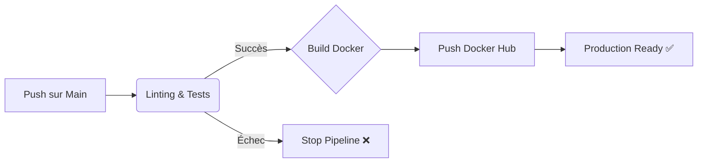

# 🐳 Docker Flask Redis Counter


[](https://github.com/Chilliou/docker-flask-redis-counter/actions)


> **Projet DevOps complet : Architecture Micro-services & Pipeline CI/CD.**
> Démonstration d'une application Python/Flask stateful, conteneurisée et déployée automatiquement via GitHub Actions.
---

## 📖 Documentation Utilisée

- [QuickStart](https://docs.docker.com/compose/gettingstarted/)

- [Automate your builds with GitHub Actions](https://docs.docker.com/guides/ruby/configure-github-actions/)

## 🔄 Pipeline CI/CD (Automation)

Ce projet intègre une chaîne d'intégration et de déploiement continu (**GitHub Actions**) qui garantit la qualité et la livraison du code sans intervention humaine.

**Workflow :**
1.  **Code Quality (CI)** : Analyse statique du code avec `Flake8` (Linting) pour respecter les standards PEP8.
2.  **Automated Testing (CI)** : Exécution des tests unitaires avec `Pytest`.
3.  **Security** : Gestion des secrets (Docker Token) via GitHub Secrets.
4.  **Delivery (CD)** : Si les tests passent, construction de l'image Docker multi-arch et push automatique sur le **Docker Hub**.


---


## 🏗 Architecture

L'application est composée de deux services isolés :

1.  **Web App (Python/Flask)** : Sert l'interface utilisateur et communique avec la base de données.
2.  **Database (Redis Alpine)** : Stocke le nombre de visites (Stateful).

**Points techniques clés :**
* Isolation des processus via **Docker Containers**.
* Communication inter-conteneurs via un **Bridge Network** privé (DNS interne).
* Configuration dynamique via **Environment Variables** (Pas de hardcoding d'IPs).
* Optimisation de l'image Python (utilisation de l'image `slim` et gestion du cache des layers).

---

## 🚀 Démarrage Rapide

### Prérequis
* Docker & Docker Compose installés.

### Installation

1.  **Cloner le dépôt**
    ```bash
    git clone https://github.com/Chilliou/docker-flask-redis-counter.git
    cd docker-flask-redis-counter
    ```

2.  **Lancer la stack (Build & Run)**
    ```bash
    docker-compose up --build -d
    ```

3.  **Accéder à l'application**
    Ouvrir le navigateur à l'adresse : [http://localhost:8000](http://localhost:8000)

4.  **Arrêter les services**
    ```bash
    docker-compose down
    ```

---

## 📂 Structure du Projet

```bash
.
├── app.py              # Code source de l'application Flask
├── Dockerfile          # Instructions de build de l'image Web
├── docker-compose.yml  # Orchestration des services & Réseau
├── requirements.txt    # Dépendances Python
└── README.md           # Documentation
```

## 🛠 Commandes Utiles
Vérifier les logs du conteneur web :

```Bash

docker-compose logs -f web
```
Vérifier l'état des conteneurs :

```Bash

docker-compose ps
```
Accéder au shell du conteneur Redis :

```Bash
docker-compose exec redis_db sh
```

## 👤 Auteur
Chilliou - Ingénieur DevOps Junior
